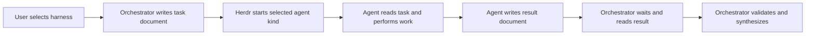

# Version 2: Herdr orchestration

Status: design contract. Version 1 behavior remains active. No source-derived orchestration skill has been migrated yet.

## Goal

Version 2 replaces provider-specific subagent services with one harness-neutral delegation path. An orchestrator uses Herdr to run the agent kind selected by the user or project configuration. That agent may be Codex, OpenCode, Cursor, Claude, or any other kind supported by the installed Herdr CLI.

The existing skill names and domain workflows remain intact. Only the mechanism used to delegate work changes.

## Invariants

- Orchestration skills never call a provider task API, cloud-worker service, background-agent shortcut, or hard-coded model slug directly.
- The user's requested harness wins. If the user has not selected one, use an explicit project setting. Do not silently substitute a different provider.
- Validate available agent kinds using the installed Herdr CLI; examples in a skill are not evidence that a kind is installed.
- Herdr owns terminal placement, agent startup, prompting, lifecycle state, and output inspection.
- Every delegated task has a durable task document and result document. Terminal output is operational evidence, not the handoff format.
- Read-only agents may share the project checkout. Agents that write code use isolated worktrees or explicitly disjoint write scopes.
- The parent orchestrator owns synthesis, validation, and the final answer. It does not forward an agent report without checking it.
- If Herdr is unavailable, fail closed or execute sequentially in the parent. Never fall back to an undeclared provider service.

## Harness selection

Resolve the agent kind in this order:

1. The kind named by the user for this run or role.
2. A role-specific kind in project configuration.
3. A project-wide default kind.
4. No delegation. Continue safely in the parent when that preserves the requested outcome; otherwise ask which harness to use.

The configuration shape should stay small:

```yaml
default_kind: codex
roles:
  reviewer: cursor
  researcher: opencode
  implementer: codex
```

These values are Herdr agent kinds, not model identifiers. Provider-native arguments are optional and must come from explicit user or project configuration.

## Artifact protocol

Runtime artifacts live outside version control:

```text
.herdr/runs/<run-id>/
|-- manifest.md
|-- tasks/
|   `-- <agent-name>.md
`-- results/
    `-- <agent-name>.md
```

The run manifest records the selected harnesses, working directories or worktrees, task/result paths, and lifecycle status.

Each task document contains:

- objective and completion boundary;
- source pointers instead of duplicated context;
- allowed read and write scope;
- required checks;
- exact result-document path and result schema.

Each result document contains:

- `status`: completed, blocked, or failed;
- concise outcome;
- evidence and checks run;
- files, commits, or branches changed;
- unresolved risks or questions.

For a Cursor worker, for example, Herdr starts a Cursor agent in the selected pane or worktree. The prompt points it to its task document and requires it to write the result document before reporting completion. The parent waits through Herdr, reads the result document, inspects the actual changes or evidence, and then synthesizes the outcome.

## Runtime flow



The orchestrator should use Herdr lifecycle state to detect `idle`, `done`, `blocked`, and startup failures. A blocked agent is inspected and surfaced to the user rather than answered automatically when authorization or a material choice is required.

## Migration surface

The v2 implementation should introduce one shared `herdr-delegate` skill or equivalent protocol reference. Existing skills route through it instead of each embedding a different provider call.

Migrate in increasing order of coordination risk:

1. Single-worker flows: `research`, `no-comments`, `show-me-your-work`, and `claude-handoff`.
2. Read-only fan-out: `code-review`, `how`, `why`, `interrogate`, `reflect`, `recall`, and `maintain-verification-skill`.
3. Candidate and coverage orchestration: `arena`, `swarm`, `automate-me`, and architecture exploration.
4. Writing agents and dependency graphs: `implement-spec`, `wayfinder`, and Poteto orchestration playbooks.

`claude-handoff` should become harness-neutral in behavior even if its compatibility name is retained. Pstack model-role configuration should map roles to Herdr agent kinds rather than Cursor model slugs.

## Acceptance criteria

- A user can select different installed Herdr agent kinds for different roles in one run.
- Cursor, Codex, OpenCode, or another configured kind receives the same task-document contract.
- Every completed delegation produces a readable result document at the declared path.
- Parallel writers cannot modify the same checkout concurrently.
- No migrated skill contains an active direct call to Cursor Task, cloud workers, `claude --bg`, or another provider-specific subagent service.
- Missing Herdr state or an unavailable requested kind produces a clear stop or safe parent-only execution, never a hidden provider fallback.
- The skills CLI still discovers 82 unique source-derived skills plus any new shared orchestration skill introduced for v2.

## Rollback

The immutable v1 baseline is tagged `v1.0.0`.

Inspect it without changing the current branch:

```bash
git switch --detach v1.0.0
```

Create a recoverable branch from the baseline:

```bash
git switch -c restore-v1 v1.0.0
```

Do not rewrite or move the `v1.0.0` tag after publishing it.
